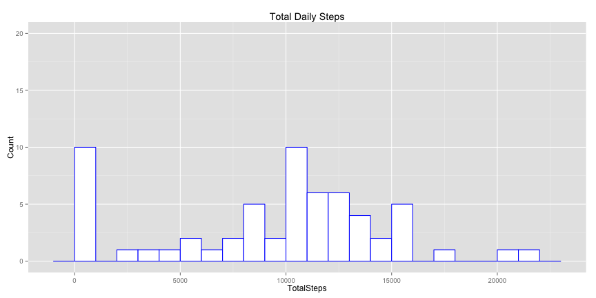
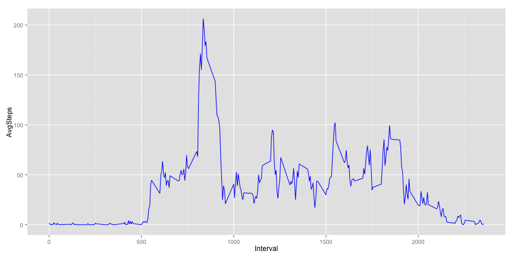
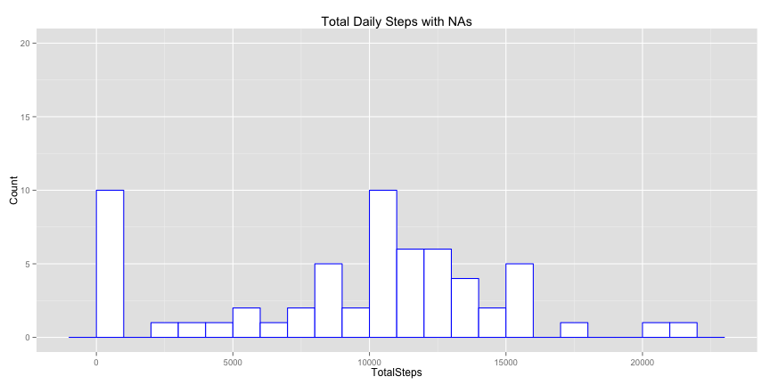
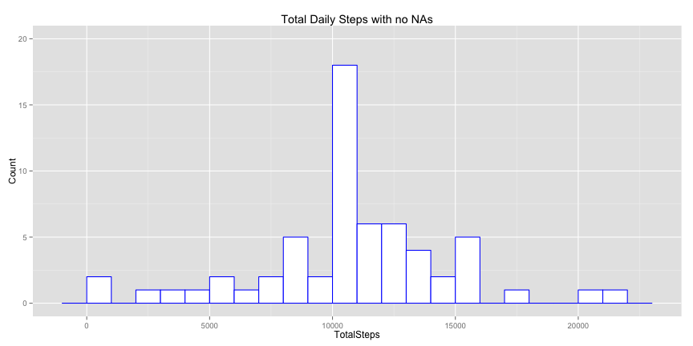
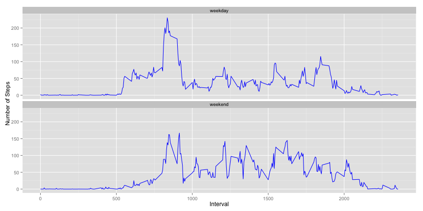

# Reproducible Research: Peer Assessment 1
## Summary
This document describes the steps carried out along with the results of the analysis of activity data. The data is from an activity monitor and has attributes list below
- Steps
- Date
- 5 minute interval

## Loading and preprocessing the data

The data file is being loaded with the following commands. Not much of pre-processing is needed. ggplot2 will be used to produce the charts. So, the ggplot2 library is also being loaded.


```r
setwd("/Users/bdcoe/Documents/r/ReproducibleAnalysis")
activity <-read.csv("activity.csv",header=T)
library(ggplot2)
```

## What is mean total number of steps taken per day?


```r
activity_day <- aggregate(activity$steps,list(activity$date),sum,na.rm=TRUE)
names(activity_day) <-c("Date","TotalSteps")
head(activity_day)
```

```
##         Date TotalSteps
## 1 2012-10-01          0
## 2 2012-10-02        126
## 3 2012-10-03      11352
## 4 2012-10-04      12116
## 5 2012-10-05      13294
## 6 2012-10-06      15420
```

The daily total aggregate steps are produced using the above commands. Records that have NAs for steps are excluded from the aggregation.

The mean and median are shown below.

```r
mean(activity_day$TotalSteps)
```

```
## [1] 9354.23
```

```r
median(activity_day$TotalSteps)
```

```
## [1] 10395
```


```r
ggplot(activity_day,aes(x=TotalSteps)) + geom_histogram(binwidth=1000,colour="blue", fill="white")  + ylab("Count") + ggtitle("Total Daily Steps") + ylim(0,20)
```

 

 The histogram plot above depicts the total steps taken on a daily basis. As we can see, the number of days where close to 0 steps and little over 10,000 steps were taken is about 10 times each, over the two months period. 
## What is the average daily activity pattern?


```r
activity_5MinInterval <-aggregate(activity$steps,list(activity$interval),mean,na.rm=TRUE)
names(activity_5MinInterval) <-c("Interval","AvgSteps")
activity_5MinInterval$AvgSteps <-round(activity_5MinInterval$AvgSteps,2)
head(activity_5MinInterval)
```

```
##   Interval AvgSteps
## 1        0     1.72
## 2        5     0.34
## 3       10     0.13
## 4       15     0.15
## 5       20     0.08
## 6       25     2.09
```
The average daily activity data for each of the intervals across the two months data is produced using the above commands. Records that have NAs for steps are excluded from the aggregation.


```r
maxStep<-max(activity_5MinInterval$AvgSteps)
activity_5MinInterval[activity_5MinInterval$AvgSteps==maxStep,]
```

```
##     Interval AvgSteps
## 104      835   206.17
```


```r
ggplot(activity_5MinInterval,aes(x=Interval,y=AvgSteps)) + geom_line(colour="blue")
```

 

As we can see from the above plot and output, 206.17 steps, which is the most steps during any 5 minute interval of the day, was taken at the interval 835. 
## Imputing missing values


```r
sum(is.na(activity$steps))
```

```
## [1] 2304
```
There are 2,304 NAs in the data. The NAs for a given interval is replaced with the average steps for the same interval from across the two months data.


```r
activity_nona <-cbind(activity,activity_5MinInterval)
activity_nona$steps[is.na(activity_nona$steps)] <-activity_nona$AvgSteps[is.na(activity_nona$steps)]
activity_nona<-activity_nona[,1:3]

activity_nona_day <- aggregate(activity_nona$steps,list(activity_nona$date),sum,na.rm=TRUE)
names(activity_nona_day) <-c("Date","TotalSteps")
head(activity_nona_day)
```

```
##         Date TotalSteps
## 1 2012-10-01   10766.13
## 2 2012-10-02     126.00
## 3 2012-10-03   11352.00
## 4 2012-10-04   12116.00
## 5 2012-10-05   13294.00
## 6 2012-10-06   15420.00
```

```r
mean(activity_nona_day$TotalSteps)
```

```
## [1] 10766.18
```

```r
median(activity_nona_day$TotalSteps)
```

```
## [1] 10766.13
```
After the NAs are replaced, we see that the average steps per day went up from 9,354.23 to 10766.18 and the median steps went up from 10,395 to 10,766.13 steps. 

From the histogram plots below, we see that the number of days where close to 0 steps are taken goes down from about 10 times (with NAs) to 4 (without NAs) and the times when little over 10,000 steps were taken goes up from 10 times to about 16 times. 

```r
ggplot(activity_day,aes(x=TotalSteps)) + geom_histogram(binwidth=1000,colour="blue", fill="white")  + ylab("Count") + ggtitle("Total Daily Steps with NAs") + ylim(0,20)
```

 

```r
ggplot(activity_nona_day,aes(x=TotalSteps)) + geom_histogram(binwidth=1000,colour="blue", fill="white")   + ylab("Count") + ggtitle("Total Daily Steps with no NAs") + ylim(0,20)
```

 

## Are there differences in activity patterns between weekdays and weekends?

```r
activity_nona$DayOfWeek <-weekdays(as.Date(activity_nona$date,'%Y-%m-%d'))
activity_nona$Weekday_R_Weekend<-c("weekday")
activity_nona$Weekday_R_Weekend[activity_nona$DayOfWeek=="Saturday"] <- c("weekend")
activity_nona$Weekday_R_Weekend[activity_nona$DayOfWeek=="Sunday"] <- c("weekend")

activity_nona_weekend <- activity_nona[activity_nona$Weekday_R_Weekend=="weekend",]
activity_nona_weekday <- activity_nona[activity_nona$Weekday_R_Weekend=="weekday",]

activity_nona_weekendAgg <-aggregate(activity_nona_weekend$steps,list(activity_nona_weekend$interval,activity_nona_weekend$Weekday_R_Weekend),mean)
names(activity_nona_weekendAgg) <-c("Interval","Weekday_R_Weekend","Steps")
activity_nona_weekendAgg$Steps <-round(activity_nona_weekendAgg$Steps,2)

activity_nona_weekdayAgg <-aggregate(activity_nona_weekday$steps,list(activity_nona_weekday$interval,activity_nona_weekday$Weekday_R_Weekend),mean)
names(activity_nona_weekdayAgg) <-c("Interval","Weekday_R_Weekend","Steps")
activity_nona_weekdayAgg$Steps <-round(activity_nona_weekdayAgg$Steps,2)

AllDays <-rbind(activity_nona_weekdayAgg,activity_nona_weekendAgg)
```


```r
ggplot(AllDays,aes(x=Interval,y=Steps,group=1)) + geom_line(colour="blue") + facet_wrap(~Weekday_R_Weekend,2) + ylab("Number of Steps") + xlab("Interval")
```

 

As evident from the above plot, we see that more average steps were taken between interval 1000 to 2,000 over the weekend compared to the weekday.
